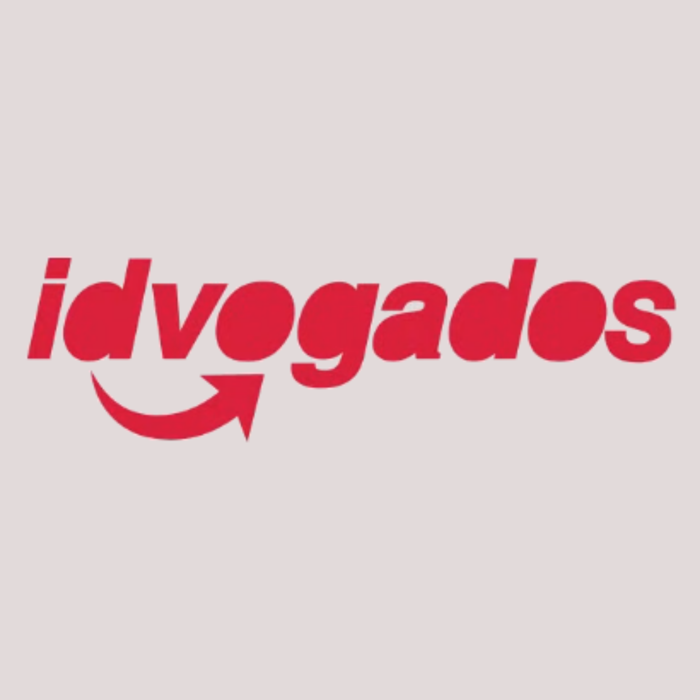
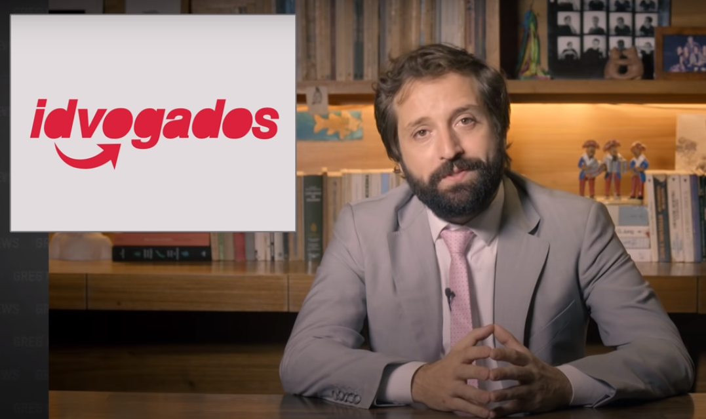

<h1 align="center">
    
</h1>

<h4 align="center">
  🏍 idvogados (back-end)
</h4>

  <a href="#rocket-tecnologias">Tecnologias</a>&nbsp;&nbsp;&nbsp;|&nbsp;&nbsp;&nbsp;
  <a href="#-projeto">Projeto</a>&nbsp;&nbsp;&nbsp;|&nbsp;&nbsp;&nbsp;
  <!-- <a href="#-video-do-projeto">Video</a>&nbsp;&nbsp;&nbsp;|&nbsp;&nbsp;&nbsp; -->
  <a href="#-contato">Contato</a>

## :rocket: Tecnologias

Esse projeto foi desenvolvido utilizando:

- [Node.js](https://nodejs.org/en/)
- [Express](https://expressjs.com/pt-br/)
- [Sequelize](https://sequelize.org/v5/)
- [MySQL](https://www.mysql.com/)
- [Socket.io](https://socket.io/docs)

## 💻 Projeto

O idvogados é um projeto que visa posibilitar a entregadores que não tem seus direitos trabalhistas a achar advogados que estejam dispostos ajudar em suas causas trabalhistas. Não fui eu que tive a ideia, esse projeto foi uma proposta sugerida neste video do canal do greg news, a partir dos ultimos 10min.

  

- [Link para o video completo](https://www.youtube.com/watch?v=v3B9w6wWNQA)

Existe um projeto onpesorce que está colocando este projeto para funcionar, link para o repositorio: [Idvogados Open-source](https://github.com/thr0w/idvogados). 

Não estou com o intuito de ganhar dinheiro em cima desta ideia, meu unico objetivo é fazer um projeto com as techs node, reactjs e react-native, para melhorar minhas habilidades com as ferramentas de desenvolvimento.

E usando as palavras do greg no video: `"Caso os aplicativos alegem que estamos incentivando os entregadores a fazer uma guerra judicial contra eles, saibam que a plataforma vai incluir um termo de uso que vai deixar bem claro que a gente não tem nenhuma relação com os advogados, nem com os entregadores, nem com a plataforma e nem com ninguém. E ao contrario dos aplicativos de entrega a gente não vai cobrar nada por essa ponte, nenhuma porcentagem do processo, porque essa é a cultura da nossa empresa. É não ganhar, em cima, do trabalho dos outros."`

Mas não vou colocar em produção, então acaba que foi meio desnecessario essa citação, mas coloquei por motivos legais.

Mas diferentemente a aplicação que vou fazer não vai ser apenas e exclusivamente para entregadores e advogados de causas trabalhistas, vai ser para todos os advogados e para todos os tipos de pessoas que estejam procurando um advogado.

## 📧 Contato

- Email: natan.miranda02@gmail.com
- [Linkdin](https://www.linkedin.com/in/natan-bezerra-de-miranda-0b4b93180/)
- [Instagram](https://www.instagram.com/neitan_miranda02/)

---

Feito com ♥ by Natan Bezerra de Miranda :wave: